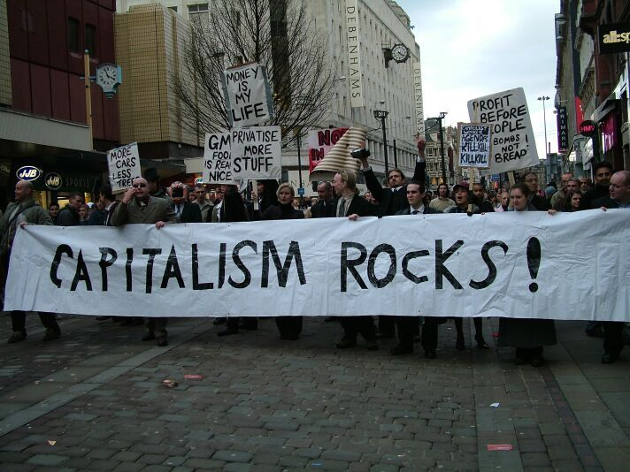

## our project

* raises awareness on the panama papers leak
* aims to ridicule the system
* use "rules" mined from the data to
    * generate a company name
    * pick an intermediary
    * pick a juristiction
    

---

## results

* application: https://safferli.shinyapps.io/hackathon_shiny/
* code on github: [@safferli/mission_economy_hackathon2016](https://github.com/safferli/mission_economy_hackathon2016)
* infographic: on [github](https://github.com/safferli/mission_economy_hackathon2016/blob/master/offshore-company-name-generator.jpg), or on [imgur](https://offshoreleaks.icij.org/)

---

## Conclusion

